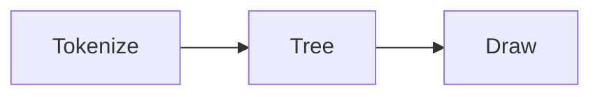
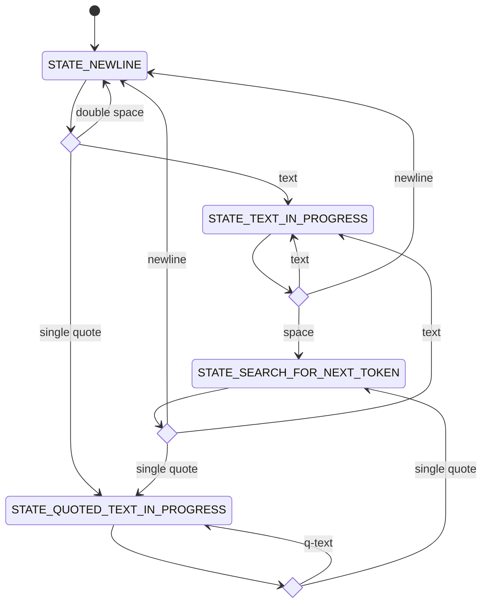
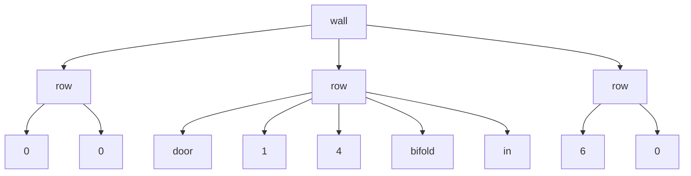

## Steps




## Tokenizer State Graph                    

| Transition   | Definition |
|--------------|------------|
| double space | two spaces - technically there's an intermediate STATE_INDENTION_IN_PROGRESS state, but it explodes the diagram. |
| text         | a-z A-Z 0-9 |
| single quote | '           |
| newline      | \n          |
| q-text       | any character that's not a single quote or newline |




# Rethinking things to follow an established pattern

The initial steps of parsing raw text into something that is structured is a standard compiler implemtation does. Let's see if we can borrow from common compiler design to help this flow better.

- Lexical Analysis: Done by a `lexer`. Tokenizes source code into meaningful units (tokens).
- Syntax Analysis: Done by a `parser`. Parses tokens into a `syntax tree` based on grammer rules.
- Semantic Analysis: Done by a `???`. Ensures correctness of meaning.

See [Basics of Compiler Design | Torben Ægidius Mogensen](https://hjemmesider.diku.dk/~torbenm/Basics/basics_lulu2.pdf), section 1.2 The phases of a compiler.

On the semantic analysis, flipping through the [GCC source code on GitHub](https://github.com/gcc-mirror/gcc), I found that many languages had parsers and lexers, but there wasn't a consistant name for a semantic analyser. Instead, they have specific semantic analyzers - for example a type checker.

## Tree Structure Example

Let's take this all as an example:

```
wall
  0 0
  door 1 4 bifold in
  6 0
```
Tokenized, this would be

`wall`, `newline`, `indent`, `0`, `0`, `newline`, `indent`, `door`, `1`, `4`, `bifold` `in`, `newline`, `indent`, `6`, `0`

The syntax tree for this would be




